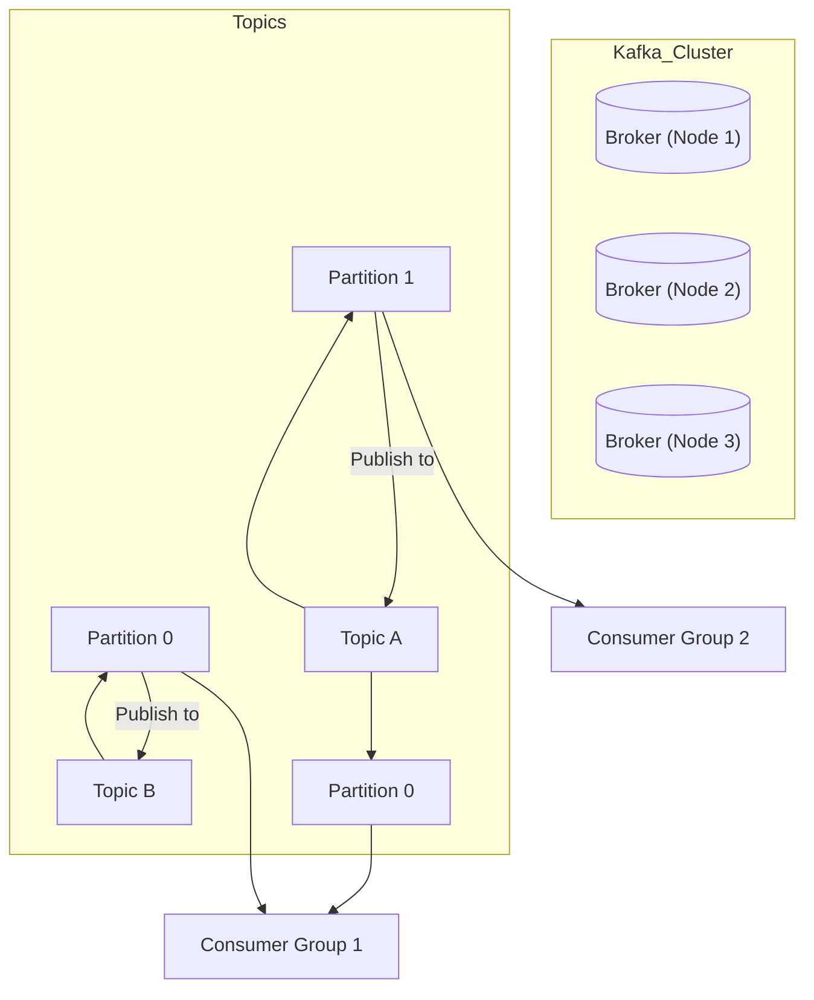
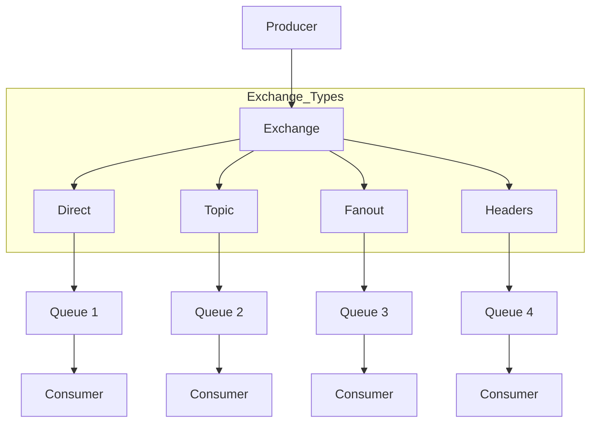
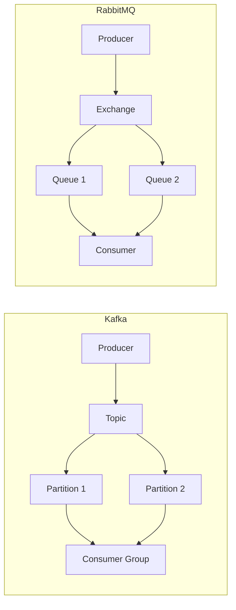
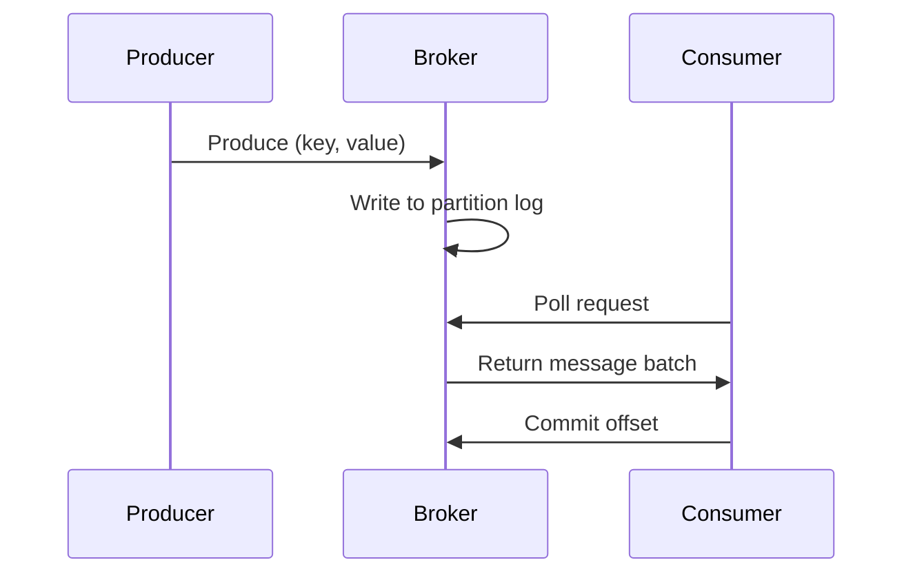
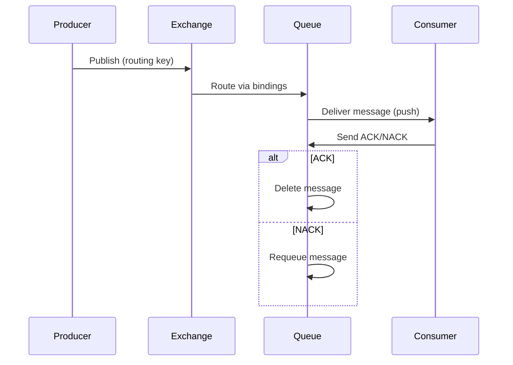
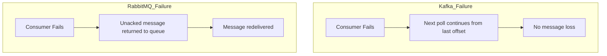

# Kafka vs RabbitMQ Workflow Comparison

Visual workflow comparison using Mermaid diagrams.

## Kafka Architecture

**Key Components:**
- Producers publish to partitioned topics
- Brokers store messages in partitions
- Consumer groups subscribe to partitions
- Messages persist based on retention policy

## RabbitMQ Architecture

**Key Components:**
- Producers send to exchanges
- Exchanges route to queues based on type/bindings
- Consumers subscribe to queues
- Messages deleted after acknowledgment

## Side-by-Side Comparison

| Feature          | Kafka                          | RabbitMQ                     |
|------------------|--------------------------------|------------------------------|
| **Message Model**| Persistent log                 | Temporary queues             |
| **Delivery**     | Pull-based                     | Push-based (default)         |
| **Ordering**     | Per-partition guarantee        | Per-queue FIFO               |
| **Routing**      | Simple (topic/partition)       | Complex (exchange types)     |
| **Scale**        | Horizontal partitioning        | Vertical scaling (sharding)  |

## Message Flow Sequence

### Kafka Sequence

### RabbitMQ Sequence

## Failure Handling Comparison

**Installation Note:**  
GitHub natively supports Mermaid diagrams. For local viewing:
1. VS Code: Install "Mermaid Preview" extension
2. Online: Use [Mermaid Live Editor](https://mermaid.live)

